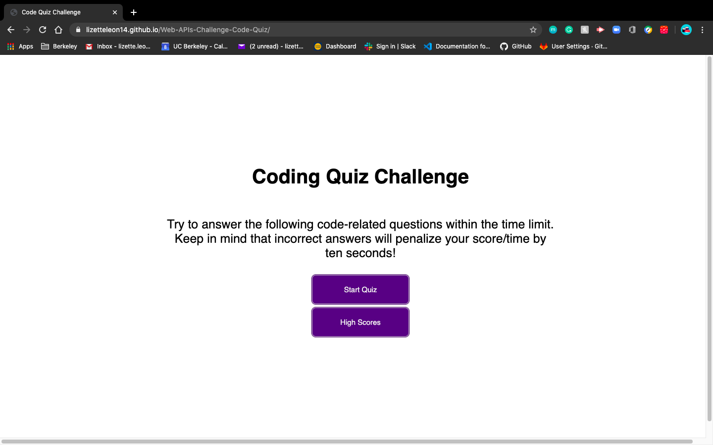

# Web-APIs-Challenge-Code-Quiz
<!DOCTYPE html>

<html lang="en-us">
    <head>
        <meta charset="UTF-8" />
    </head>
    <header>
        <h2>
            Description
        </h2>
            

            

        <h2>
            Technologies Used:
        </h2>   
            

                HTML, CSS, Javascript, APIs
            

    <header>
    <section>
      
    </section>
    <section>
        

            The URL of the deployed application
            <a href="https://lizetteleon14.github.io/Web-APIs-Challenge-Code-Quiz/">The URL of the deployed application</a>
        

    </section>
    <section>
        

            The URL of the GitHub repository 
            <a href="https://github.com/lizetteleon14/Web-APIs-Challenge-Code-Quiz">The URL of the Git</a>
        

    </section>